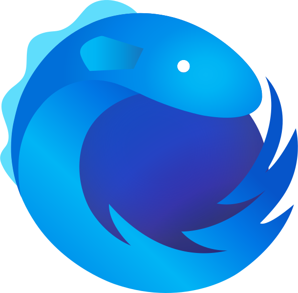

#  RxJS Web Library

This library aims to provide an `observable` based API, that wraps the web APIapi. This also includes experimental, non-standard and not well-supported APIs. Polyfills need to be provided by the user of this library if necessary.

This library uses the Observable implementation of [rxjs >= 6](https://www.npmjs.com/package/rxjs).

The public API surface of this library can be affected by breaking changes within the experimental API used.

Additionally, the implementation of this library makes use of [globalThis](https://developer.mozilla.org/en-US/docs/Web/JavaScript/Reference/Global_Objects/globalThis) which breaks ie <= 11! There is no plan to add support for IE 11 in this library.

## Supported API Roadmap

| API                                                                                                               | Implemented | Tested  | Experimental/not well supported |
| ----------------------------------------------------------------------------------------------------------------- | ----------- | ------- | ------------------------------- |
| [Bluetooth API](https://developer.mozilla.org/en-US/docs/Web/API/Web_Bluetooth_API)                               | &#9744;     | &#9744; | &#9745;                         |
| [Broadcast Channel API](https://developer.mozilla.org/en-US/docs/Web/API/Broadcast_Channel_API)                   | &#9744;     | &#9744; | &#9744;                         |
| [dynamic import](https://developer.mozilla.org/en-US/docs/Web/JavaScript/Reference/Statements/import)             | &#9745;     | &#9744; | &#9744;                         |
| [File and Directory Entries API](https://developer.mozilla.org/en-US/docs/Web/API/File_and_Directory_Entries_API) | &#9744;     | &#9744; | &#9745;                         |
| [Geolocation API](https://developer.mozilla.org/en-US/docs/Web/API/Navigator/geolocation)                         | &#9745;     | &#9744; | &#9744;                         |
| [Image Capture API](https://developer.mozilla.org/en-US/docs/Web/API/MediaStream_Image_Capture_API)               | &#9744;     | &#9744; | &#9745;                         |
| [IntersectionObserver](https://developer.mozilla.org/en-US/docs/Web/API/Intersection_Observer_API)                | &#9745;     | &#9744; | &#9745;                         |
| [matchMedia](https://developer.mozilla.org/en-US/docs/Web/API/Window/matchMedia)                                  | &#9745;     | &#9744; | &#9744;                         |
| [MutationObserver](https://developer.mozilla.org/de/docs/Web/API/MutationObserver)                                | &#9745;     | &#9744; | &#9744;                         |
| [Network Information API](https://developer.mozilla.org/en-US/docs/Web/API/NetworkInformation)                    | &#9745;     | &#9744; | &#9745;                         |
| [PerformanceObserver](https://developer.mozilla.org/en-US/docs/Web/API/PerformanceObserver)                       | &#9745;     | &#9744; | &#9745;                         |
| [Push API](https://developer.mozilla.org/en-US/docs/Web/API/Push_API)                                             | &#9744;     | &#9744; | &#9745;                         |
| [Permission API](https://developer.mozilla.org/en-US/docs/Web/API/Permissions)                                    | &#9745;     | &#9744; | &#9745;                         |
| [ResizeObserver](https://developer.mozilla.org/en-US/docs/Web/API/ResizeObserver)                                 | &#9745;     | &#9744; | &#9745;                         |
| [Sensor APIs](https://developer.mozilla.org/en-US/docs/Web/API/Sensor_APIs)                                       | &#9745;     | &#9744; | &#9745;                         |
| [Vibration API](https://developer.mozilla.org/en-US/docs/Web/API/Vibration_API)                                   | &#9744;     | &#9744; | &#9745;                         |

## API Reference

General Hint: Usually Promises are eager. All the APIs provided by this library, that wraps native promise-based APIs, are lazy though. This design decision was made due to the general specification of Observables.

### Observer

#### fromIntersectionObserver

#### fromMutationObserver

#### fromPerformanceObserver

#### fromResizeObserver

### other Web-APIs

#### fromImport

#### fromMediaListQuery

#### fromNetwork

#### fromPermission

#### fromPosition

#### fromSensor

## Credits

This project is build upon the [typescript library starter](https://github.com/alexjoverm/typescript-library-starter). Kudos to [@alexjoverm](https://twitter.com/alexjoverm) and every contributor of this amazing project!

Many thanks also goes to [Sascha Nuissl](https://twitter.com/saschanuissl) for creating this fantastic logo!
